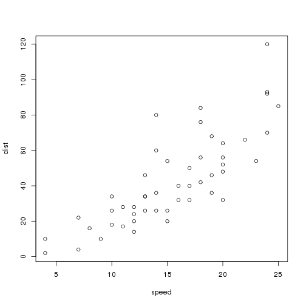
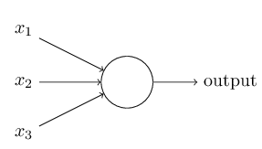
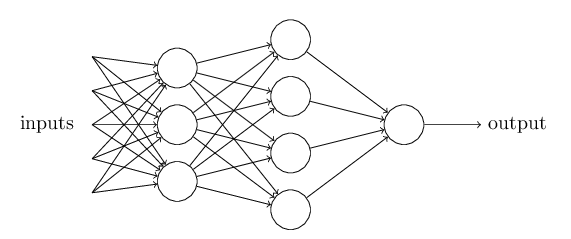
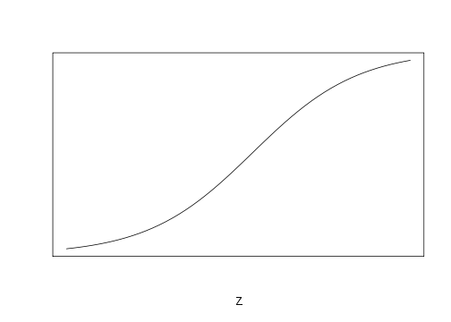

The Brain of the Storm: Using neural networks to predict hurricane severity
========================================================
author: Maddi Cowen, Ciaran Evans, and Samantha Morrison  
date: 

Background
========================================================

For more details on authoring R presentations click the
**Help** button on the toolbar.

- Bullet 1
- Bullet 2
- Bullet 3

Slide With Code
========================================================


```r
summary(cars)
```

```
     speed           dist       
 Min.   : 4.0   Min.   :  2.00  
 1st Qu.:12.0   1st Qu.: 26.00  
 Median :15.0   Median : 36.00  
 Mean   :15.4   Mean   : 42.98  
 3rd Qu.:19.0   3rd Qu.: 56.00  
 Max.   :25.0   Max.   :120.00  
```

Slide With Plot
========================================================

 

Neural Networks- Perceptron
========================================================

Perceptron


-takes binary inputs $(x_1, x_2, x_3)$ and gives one binary output

-to determine the output, each input was given a weight $(w_1, w_2, w_3)$

-the ouput of 0,1 is based on whether $\Sigma_j{ w_jx_j}$ is above or below a *threshold value*

figure and info from: 
http://neuralnetworksanddeeplearning.com/chap1.html

Neural Networks- Perceptrons
========================================================
-basic model of human decision making


-first layer perceptron make 3 decisions  
-second layer perceptron weighs results from first layer

-allows for complex decisions
-each perceptron only gives one output; used as inputs to several perceptrons

http://neuralnetworksanddeeplearning.com/chap1.html

Neural Networks- decision rule
========================================================
-to describe output decision  
denote:  
$w\cdot x = \Sigma_j{ w_jx_j}$  
$bias\equiv -$ threshold

$output=\{^{0\text{ } if\text{ }  w\cdot x \text{ }  + \text{ } b\text{ }  \le\text{ }  0}_{1\text{ } if\text{ } w\cdot x \text{ }  + \text{ } b\text{ }  > \text{ }  0}$

-when bias is positive, large, "easier" to get output of 1
-when bias negative, "harder" to get 1

-perceptrons can compute basic logical functions
http://neuralnetworksanddeeplearning.com/chap1.html

Neural Networks- learning
========================================================
-can use for *learning algorithms* that tune weights and biases  

-learning: ideally small changes in weight biases --> small change in output  

-iteratively make small changes to improve network


-does not work w/ perceptrons  

-instead use a *sigmoid* neuron
http://neuralnetworksanddeeplearning.com/chap1.html

Neural Networks- sigmoid neuron
========================================================

differences:  
-inputs $(x_1, x_2, x_3)$ continuous b/w 0, 1 -output not 0,1
$ouput = \sigma(w\cdot x + b)$

$\sigma$ sigmoid function  
$\sigma (z) \equiv \frac{1}{1 + e^{-z}}$

$ouput = \frac{1}{1 + \exp{(-\Sigma_j{ w_jx_j-b})}}$

$z \equiv w\cdot x + b$
when z is large, positive, exponent ~ 0, $\sigma(z) \approx 1$

when z large, negative approx 0  
-similar to perceptron when z large  
http://neuralnetworksanddeeplearning.com/chap1.html

Neural Networks- sigmoid function
========================================================

 

-smoothed out step function  
-perceptron is a step function  
-smoothing --> small changes in weight, bias result in small changes in output  
http://kyrcha.info/2012/07/08/tutorials-fitting-a-sigmoid-function-in-r/  
http://neuralnetworksanddeeplearning.com/chap1.html

Neural Networks- sigmoid function
========================================================

-with sigmoid function  
$\Delta output \approx \Sigma_j{\frac{\partial output}{\partial w_j} \Delta w_j + \frac{\partial output}{\partial b} \Delta b}$  
-change in output a linear function of change in weights and bias  
http://neuralnetworksanddeeplearning.com/chap1.html
