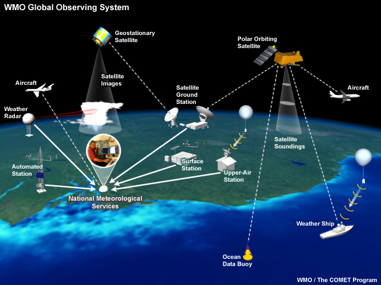
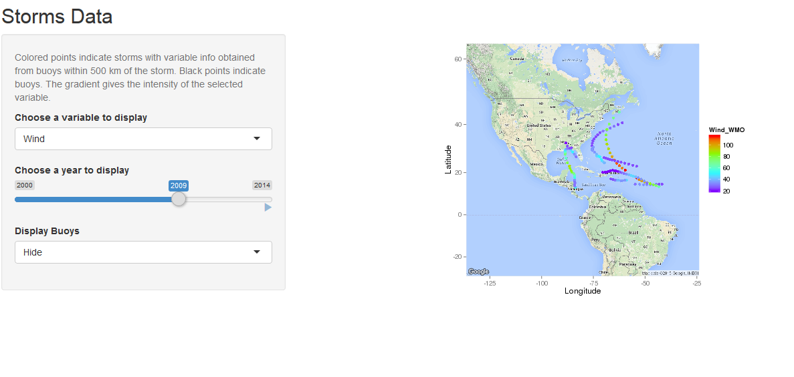

The Brain of the Storm: Using neural networks to predict hurricane severity
========================================================
author: Maddi Cowen, Ciaran Evans, and Samantha Morrison  
date:

Introduction: Storms
========================================================
Studying and understanding storms is an important area of research.


Introduction: Measuring Storms
========================================================
A wide array of technology is used to gather storm data.


How well can we use buoys by themselves?


NOAA and Buoys
========================================================
National Oceanographic and Atmospheric Administration (NOAA) runs National Data Buoy Center (NDBC), which maintains and operates a network of buoys:


Project Overview
========================================================
Assess ability of buoys by themselves to estimate weather conditions of surrounding areas
- Goal: combine information from North Atlantic storms with meteorological data from buoys.
  - Storms: NOAA Best Track Archive for Climate Stewardship (IBTrACS)
  - Buoys: NOAA National Data Buoy Center (NDBC)
- Match each storm observation with data from nearby buoys
- Output goal:


Neural Networks- Neurons
========================================================

  $\hspace{1cm}$ 


-single perceptron takes binary inputs $(x_1, x_2, x_3)$ and gives one output by weighting each input $(w_1, w_2, w_3)$

-$output = \sigma(w\cdot x + b)$, $\hspace{0.5cm}$ $\sigma (z) \equiv \frac{1}{1 + e^{-z}}$

figure and info from: 
http://neuralnetworksanddeeplearning.com/chap1.html


Neural Networks- learning
========================================================
- can use *learning algorithms* that tune weights and biases

- want to minimize cost, can use *gradient descent algorithm*:  
we move opposite the gradient, updating at each step


http://neuralnetworksanddeeplearning.com/chap1.html


NN- variable selection problems
========================================================

**redundancy** 
-increases number of local optima in error function (i.e. local minima in cost function)  
-training slower: harder to map relationship b/w redundant variables and error  

**irrelevant variables**  
-add noise  
-could mask important relationships  

**dimensionality**
-as dim of model increases linearly, exponential increase in sample size needed   

-many input variable selection algorithms
http://cdn.intechopen.com/pdfs-wm/14882.pdf


Neural Networks- Storms and Buoy Data
========================================================
- removed rows with NAs  

- normalized the data between 0, 1

- split into 3/4 training, 1/4 test  

Neural Networks- Variables Used
========================================================

- **WD** (wind direction);degrees clockwise from true North
- **WSPD** (wind speed); m/s averaged over 8 minute period
- **GST** (gust); peak 5 or 8 second gust speed in m/s measured during the 8 min period
- **WVHT** (wave height); meters
- **APD** (average wave period); seconds
- **BAR** (sea level pressure); hecto-Pascals (hPa)
- **ATMP** (air temperature); degrees Celsius
- **WTMP** (water temperature); degrees Celsius
- **Wind_WMO** (maximum sustained wind gust); knots


Neural Networks- Storms and Buoy Data
========================================================


MSE = 0.0154  

Neural Networks- Storms and Buoy Data
========================================================


Random Forest- Storms and Buoy Data
========================================================

Tuned for mtry and ntree parameters and then built model:


```r
# make model with parameters ntree = 250, mtry = 6
set.seed(47)

storm.model.rf <- randomForest(Wind_WMO ~., data = trainingStorms,
                               mtry = 6, ntree = 250, importance = TRUE)
```

training MSE = 0.0138  
test MSE = 0.0140


Random Forest- Storms and Buoy Data
========================================================


Shiny App- Storms and Buoy Data
========================================================


[http://rstudio.campus.pomona.edu:3838/cle02012/StormsAndBuoys/](http://rstudio.campus.pomona.edu:3838/cle02012/StormsAndBuoys/)




Model Summary
========================================================

- variables given do not seem to give enough info to predict Wind_WMO well  

- potential redundancy in variables, problem for NN


Data Processing Limitations
========================================================

- Location: restricted to the North Atlantic Basin
- Year: we studied 2000 to 2015, but there are many more years!

Buoy Limitations
========================================================
Many buoys are located along the coast, which means:
- information about storms about to hit
- less information about storms out at sea

Chosen within an arbitrary radius
- Not sure if this is the best radius to include the most relevant data
- Excludes storms far from buoys

Ocean only


Neural Networks and Missing Data
========================================================
- Rows with missing data had to be excluded
- Scaled data, but ok to use for random forests

Shiny App Limitations
========================================================
- Includes *all* buoys that have data for that year
- Buoys do not necessarily contribute to the averages in our dataset

Future Directions
========================================================
- Predict direction of the storm
- Compare buoys to other methods of predicting storm behavior

Important, especially in our changing climate!
