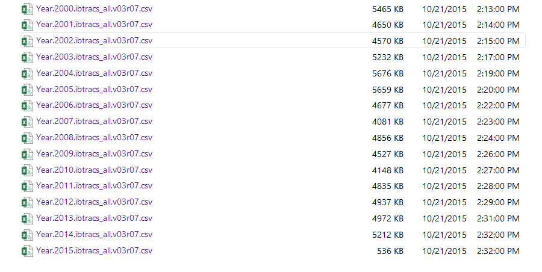
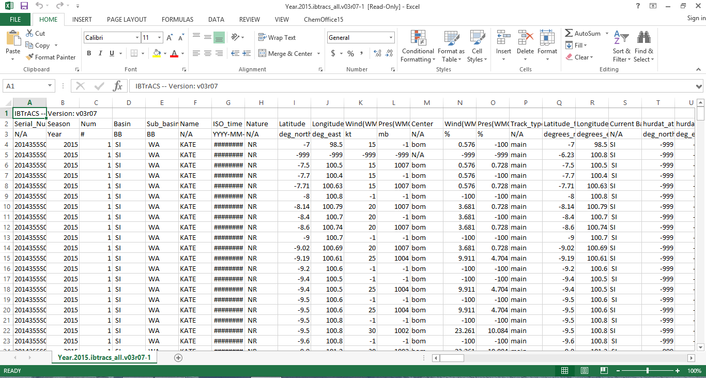

```{r, message=FALSE}

require(dplyr)
require(tidyr)
require(geosphere)
```


```{r}
#data from http://www.ncdc.noaa.gov/ibtracs/index.php?name=ibtracs-data
#ftp://eclipse.ncdc.noaa.gov/pub/ibtracs/v03r07/all/csv/year/


stormYearsFile <- c("2000.csv","2001.csv","2002.csv","2003.csv","2004.csv","2005.csv","2006.csv","2007.csv","2008.csv","2009.csv","2010.csv","2011.csv","2012.csv","2013.csv","2014.csv", "2015.csv")

allStorms <- vector("list",length(stormYearsFile)) 

#pull in csv files and assign to a list of datasets
for(i in 1:length(stormYearsFile)){
  
  allStorms[[i]] <-read.csv(paste("~/Comp-Stats-Project/storm",stormYearsFile[i], sep=""))
}

#only keep the first 19 columns
for(i in 1:length(allStorms)){
  allStorms[[i]] <- allStorms[[i]][,1:19]
}

#remove -999 from latitude and longitude
cleanStorms <- vector("list",length(stormYearsFile))

for(i in 1:length(allStorms)){
  cleanStorms[[i]] <- allStorms[[i]]%>% 
    filter(Latitude!=-999) %>% 
    filter(Longitude!=-999)
}

#first rows of storm2000 cleaned up dataset
head(cleanStorms[[1]],3)

```


We are scraping the data from [International Best Track Archive for Climate Stewardship](http://www.ncdc.noaa.gov/ibtracs/index.php?name=ibtracs-data) that has datasets for a given year with various information about storms in that year.  First we download all the csv files in the years we want.  The data that IBTrACS has for storms by year as csv looks like Figure 1.  We saved these files as storm*year* on our computer.  Each dataset looks approximately like Figure 2.  


  

Figure 1. IBTrACS Storm Data By Year  


  

Figure 2. IBTrACS Storm Data Original File  


After saving the datasets as storm*year*, we removed the first row (IBTrACS -- Version: v03r07 ) and the third row that gives units for the variable, so when we read in the csv files the header would appear correctly.


To read in the csv files for the storm data, we used a for loop that read in each storm data set and put it in a list of datasets called allStorms.  Then for each dataset storm*year*, a for loop was used to discard all columns after 19 since these were not variables of interest and often had lots of missing data (labelled as -999).  

Finally, a for loop was used to removed all rows in each storm*year* dataset that has missing data (-999) for latitude and longitude.  These cleaner datasets were assigned to the list cleanStorms.

In summary, cleanStorms is a list that holds partially cleaned up datasets of storms from years 2000 to 2015.  (i.e. cleansStorms[[1]] is the dataset for storms in the year 2000).  


```{r}

firstRow2000 <- cleanStorms[[1]][1,]

stormCoords <- c(firstRow2000$Longitude, firstRow2000$Latitude)

buoyLocations <- dget("buoyLocsAndYears.txt")
buoyLocs2000 <- buoyLocations %>% filter(year2000 == TRUE)

#function to compute dist from storm coord to buoy (buoy takes long/lat of buoy)
computeDistanceTo <- function(buoy){
  return(distGeo(stormCoords,buoy))
}

buoyLocs2000 <- buoyLocations %>% filter(year2000 == TRUE) %>%
  mutate(distToStorm = 
           apply(cbind(Longitude, Latitude), 1, computeDistanceTo)) %>%
  filter(distToStorm <= 2e7) %>% select(BuoyNumber, distToStorm)

#matrix of long/lat for each buoy (first col is long, second col is lat)
#buoyLongLat <- cbind(buoyLocs2000$Longitude, buoyLocs2000$Latitude)

#vector of distances from buoys to stormCoords
#distanceForEachBuoy<-apply(buoyLongLat, 1,computeDistanceTo) #1 computes by row


```

