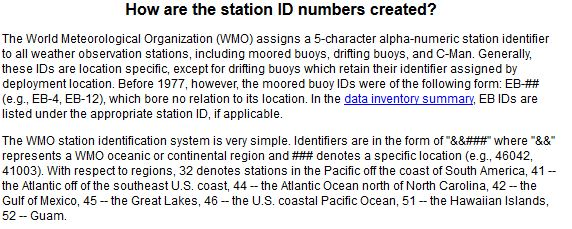
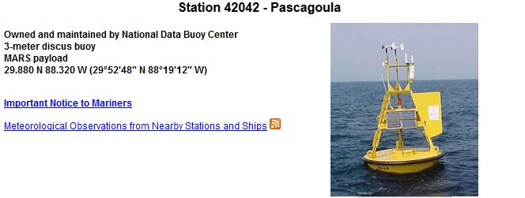
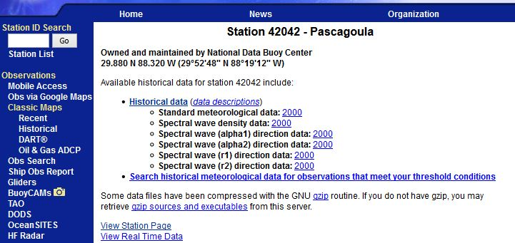
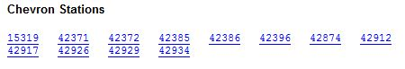

##Data Collection

For our project, we want meteorological data for each recorded storm observation in the North Atlantic.  To gather this data, we must combine meteorological data with storm observations.  The storm data comes from the NOAA Best Track Archive for Climate Stewardship (IBTrACS), and each row of this data represents a location in space and time, with values for latitude, longitude, time, and date.  To get the meteorological data at this location in the ocean, we will match the location and date-time with NOAA buoy records, select the nearest buoys to that latitude and longitude, and then look at their meteorological records at that date and time.  Our very first step will be to determine which NOAA buoys are in the correct location and have the information we need, and then make a list of those buoys.

A list of all stations can be found at [http://www.ndbc.noaa.gov/to_station.shtml](http://www.ndbc.noaa.gov/to_station.shtml); this is what part of the page looks like:


Each link is a different buoy number, and clicking on it will take you to the page for that specific buoy.  The page also contains lots of non-buoys stations, such as oil rigs, which we will have to deal with later. Let's look at one of the buoys, say [41046](http://www.ndbc.noaa.gov/station_page.php?station=41046). If we scroll down to the bottom of the page, we get a link to historical data:


Clicking on this link takes us to a page ( [http://www.ndbc.noaa.gov/station_history.php?station=41046](http://www.ndbc.noaa.gov/station_history.php?station=41046) ) with historical data, including standard meteorological data:


So buoy 41046 has historical meteorological data for 2007 - 2014, which is great for us!  Here's what the 2007 data ( [http://www.ndbc.noaa.gov/view_text_file.php?filename=41046h2007.txt.gz&dir=data/historical/stdmet/](http://www.ndbc.noaa.gov/view_text_file.php?filename=41046h2007.txt.gz&dir=data/historical/stdmet/) ) looks like:


But to get it, we would have to click on each link for each year, which takes us to a text file.  Since there are many buoys and many different years, getting all the data manually would be tedious and unproductive.  Instead, we will write some code to scrape it from the NOAA website.  First, we take all of the buoy numbers from [http://www.ndbc.noaa.gov/to_station.shtml](http://www.ndbc.noaa.gov/to_station.shtml). The source for the webpage is in HTML; each hyperlink has a specific tag, and since each buoy number is a hyperlink on the page we will grab all of the hyperlinks.  The package XML allows us to do this; the htmlTreeParse() function converts the HTML content of the webpage to a useful structure, and then xpathApply() is used to select all the hyperlinks by selecting for the hyperlink tags.

```{r, message=FALSE, eval=FALSE}

# We'll use the XML package to get info from web pages
require(XML)

# Read and parse HTML file
buoylist.html = htmlTreeParse('http://www.ndbc.noaa.gov/to_station.shtml',
                         useInternal = TRUE)
# make a vector of each hyperlink
buoylist.text = unlist(xpathApply(buoylist.html, "//a/@href"))

```

We now have a vector containing each hyperlink.  To get all the ones corresponding to buoys, we use the grep() function from the base package to find matches to the string pattern "station=" in the vector. Having found the indices of strings that contain the pattern "station=", we pull out the station number from each of those strings by selecting the substring of length 5 that start immediately after the "=" sign:

```{r, eval=FALSE}

# indices of hyperlinks that correspond to NOAA observation stations
hrefIndices <- grep("station=", buoylist.text)

# create vector to hold the buoy numbers
buoyNums <- c()

for(i in 1:length(hrefIndices)){
  href <- hrefIndices[i]  # look at each buoy index in turn
  refString <- buoylist.text[href]  # look at hyperlink at that index
  # substring starts after '=' sign
  startind <- unlist(gregexpr('=',refString)) + 1  
  # take substring of length 5, starting right after '=' sign
  buoyNums[i] <- substr(refString, startind, startind + 4)
}

```

Why do we only look at strings of lengths five? It turns out that's how long a buoy ID number is, according to the NOAA documentation at [http://www.ndbc.noaa.gov/staid.shtml](http://www.ndbc.noaa.gov/staid.shtml) :



And in fact, as we are only interested in buoys in the North Atlantic, this documentation tells us that we need only consider those buoy numbers beginning with 41, 42, or 44, so let's select just those values from the vector of buoy numbers we just created:

```{r, eval=FALSE}

buoyNums <- buoyNums[substr(buoyNums, 1,2) %in% c("41", "42", "44")]

```

Now that we have a list of buoys, we want to know the location of each buoy.  Each buoy has its latitude and longitude on the page reached by following its hyperlink.  For example, if we click on buoy [42042](http://www.ndbc.noaa.gov/station_page.php?station=42042), then we can see that its latitude and longitude are 29.880 N, 88.320 W :



Since we don't want to have to manually collect these latitude and longitude values, we will again scrape them from the HTML source for each buoy webpage.  The address for buoy 42042 is [http://www.ndbc.noaa.gov/station_page.php?station=42042](http://www.ndbc.noaa.gov/station_page.php?station=42042), and in fact every buoy has the same address up until the final 5 characters, which hold the buoy ID number. Since we have a vector containing each buoy number, we can loop through that vector and paste each number in the vector into the basic address form. Then, we can find the latitude and longitude on the HTML for that page.

```{r, eval=FALSE}

lat <- c() # vector to hold buoy latitudes
lon <- c() # vector to hold buoy longitudes

# loop over all the buoy numbers we collected
for(i in 1:length(buoyNums)){
  
  # get the HTML source for each buoy page
  doc.html = 
    htmlTreeParse(paste('http://www.ndbc.noaa.gov/station_page.php?station=',
                        buoyNums[i], sep=""),
                           useInternal = TRUE)
  # get all the paragraph (<p>) elements from the HTML
  doc.text = unlist(xpathApply(doc.html, '//p', xmlValue))
  
  # search for ' N ', which will appear immediately after the latitude
  startind1 <- min(unlist(gregexpr(' N ',doc.text[2]))) - 6 # latitude start
  stopind1 <- startind1 + 5 # latitude end
  startind2 <- stopind1 + 4 # longitude start
  stopind2 <- startind2 + 5 # longitude end
  
  # store the latitude and longitude in the vectors we made
  lat[i] <- as.numeric(substr(doc.text[2], startind1, stopind1))
  lon[i] <- as.numeric(substr(doc.text[2], startind2, stopind2))
}

# remove those which are not missing latitude and longitude
buoyNums <- buoyNums[-which(is.na(lat))]
lat <- lat[-which(is.na(lat))]
lon <- lon[-which(is.na(lon))]

```

In the last few lines, we've removed those buoys without latitude and longitude information.  Since we need the buoy locations to match them up with storms data, we can't use a buoy if we don't have its location.

We are interested in the years 2000 - 2015.  Some of the buoys we selected have data for some of these years, while some do not have data for any of these years (for example, old buoys from the '70s and '80s). So, we need to go through each buoy and determine which years it has data for.  The result will be a matrix which contains the number of each buoy, its location, and a boolean variable for each year from 2000 to 2015 which is TRUE if it has data for that year and false otherwise. 

To get the data, we note that the historical data for each buoy can be found at an address that differs only in the buoy number (again, this is the last 5 characters).  For example, for buoy 42042 the address is [http://www.ndbc.noaa.gov/station_history.php?station=42042](http://www.ndbc.noaa.gov/station_history.php?station=42042). Here's what that webpage looks like:



We want to know for which years the buoys have standard meteorological data.  For buoy 42042, as we can see in the image, data only exists for year 2000. We'll use our HTML scraping tools again to find the "Historical Data" list in the HTML source. Then, since standard meteorological data is the first item in the historical data list, we select all the numbers in that item.

```{r, eval=FALSE}

# interested in years 2000 - 2015
stormYears <- seq(from=2000, to=2015, by=1)

# make a matrix to hold buoy number, latitude, longitude, and 
#  indicator variables for which years it has data
buoyLocsAndYears <- as.data.frame(matrix(nrow=length(buoyNums), ncol=19))
names(buoyLocsAndYears) <- c("BuoyNumber", "Latitude", "Longitude", 
                             paste("year", as.character(stormYears), sep=""))

# loop over all the buoys
for(i in 1:length(buoyNums)){
  # get HTML source for the station history for each buoy in turn
  historical.html <- 
    htmlTreeParse(paste('http://www.ndbc.noaa.gov/station_history.php?station=',
                        buoyNums[i]),
                                   useInternal = TRUE)
  
  # find all the list (<li>) elements in the HTML source
  historical.text = unlist(xpathApply(historical.html, '//li', xmlValue))
  
  # find the list element that is 'Historical data'
  histString <- historical.text[grep('Historical data', historical.text)]
  
  # take the numbers from the first entry of the 'Historical data' list
  # these are the numbers that lie between the first and second '\n' substrings
  endpoints <- unlist(gregexpr('\n', histString))[c(1,2)]
  yearString <- substr(histString, endpoints[1]+2, endpoints[2]-1)
  
  # split the string (by empty spaces) to make each year a separate 
  #  element of a numeric vector
  yearsOfHistData <- as.numeric(unlist(strsplit(yearString, " ")))
  
  # for each year 2000 - 2015, test if it is in the set of years for that buoy
  #  save the results in the matrix row corresponding to that buoy
  buoyLocsAndYears[i, 4:19] <- stormYears %in% yearsOfHistData
}

```


We now have a matrix that contains the years of data for each buoy. We also want the number and location, so let's add those.  So that our latitude and longitude will be simply numeric, without the need for degrees N or W, we will use the format (found also in the IBTrACS storms data) of assigning a sign to latitude and longitude instead of a compass direction. Latitudes north of the equator and longitudes east of the prime meridian are positive, while latitudes south of the equator and longitudes west of the prime meridian are negative.  So, for example, 35.56 N 54.78 W becomes the pair (35.56, -54.78). This change is helpful both to match with the IBTrACS data and to avoid the need for character strings in storing our location data.

```{r, eval=FALSE}

# store buoy number in matrix
buoyLocsAndYears$BuoyNumber <- buoyNums 

# store latitude in matrix (all latitudes are N of equator)
buoyLocsAndYears$Latitude <- lat 

# store longitude in matrix (all longitudes are W of prime meridian)
buoyLocsAndYears$Longitude <- -1*lon

```


Finally, we can store the data if we want, using the dput() function.

```{r, eval=FALSE}

# save the data frame as a text file
#dput(buoyLocsAndYears, "buoyLocsAndYears.txt")

# If you want to access it again, use this
# dget("buoyLocsAndYears.txt")

```

However, there is a problem with the buoy collection we've just performed: some of the buoys do not have the data we need! There are two ways this can happen, either the buoy simply does not have data for the years 2000 - 2015 (its an old buoy) or it is not really a buoy.  "But how can it not be a buoy?" you ask, "since we selected the buoy numbers following the NOAA ID numbering system?" Well, as we briefly hinted at above, NOAA has information on a whole variety of stations (e.g., oil rigs), not just buoys.  The numbering system applies to ALL stations, and so we inadvertently selected a bunch of other types of station as well.  Like station number 42386, which belongs to Chevron:



We need to remove the buoys that do not have the data we want.  The way we will do this is to actually try and get the data, and see if we can.  It turns out that each year of standard meteorological data is found in a text file at a web address with the same format, differing only by buoy ID number and the year.  For example, data from 2014 for buoy 42036 is found at [http://www.ndbc.noaa.gov/view_text_file.php?filename=42036h2014.txt.gz&dir=data/historical/stdmet/](http://www.ndbc.noaa.gov/view_text_file.php?filename=42036h2014.txt.gz&dir=data/historical/stdmet/). For each buoy, we will check each year to see whether it has standard meteorlogical data for that year.  If it does for any of the years, we will store the buoy number.  We use the try() function to attempt to get data from each of these web addresses, and we make 10 attempts to get the data.  If we fail after 10 attempts, we move on to the next year.

```{r, message=FALSE}

# need dplyr package for some data wrangling
require(dplyr)

```

```{r, eval = FALSE}

# final matrix of buoy locations and years of data 
#  will be called buoyLocationsFixed
#buoyLocationsFixed<-dget("buoyLocsAndYears.txt")
buoyLocationsFixed <- buoyLocsAndYears

# numeric vector to hold the buoy numbers we want to keep
isABuoy <- c()

# loop overal all buoys
for(k in 1:(nrow(buoyLocationsFixed))){
  
  # this is TRUE until we find data for the buoy in one of the years 2000 - 2015
  notFoundDataYet <- TRUE
  
  # loop over each year 2000 - 2015
  for(j in 4:(ncol(buoyLocationsFixed))){
    buoyYear <- 1996 + j
    
    # if the historical data exists, it will be at this site
    site <- paste("http://www.ndbc.noaa.gov/view_text_file.php?filename=",
                  buoyLocationsFixed$BuoyNumber[k],
                  "h",buoyYear, ".txt.gz&dir=data/historical/stdmet/", sep ="")
        
        if(notFoundDataYet){  
          # call in buoy data with try command in while loop
          i <- 1 # 1 = failed to connect, 2 = managed to connect
          
          # count the number of times we try and fail to get the data
          countError <- 0
          
          # while we haven't connected, and have tried fewer than 10 times,
          #  try to connect
          while (i < 2 & countError < 10){
            data <- try(read.table(site,sep="", fill=TRUE, header=TRUE, 
                                   comment.char=""),
                        silent=TRUE)
            
            # if we get a try-error, we failed.  Increase the number of failures
            #  and go back to the beginning of the while loop
            if (class(data) == "try-error") {
              countError = countError + 1
              next
            } else {  # otherwise, we managed to connect, so data exists
              i <- i + 1  # increase i to stop entering the while loop
            }
          }
          
          # if we got a try error all 10 attempts, the class of our 'data'
          #   while be 'try-error', in which case we do nothing
          # otherwise, we got data and we store the buoy number as a good one
          # then set notFoundDataYet to FALSE so that when we look at the next 
          #   year we don't have to try to find data
          #   (if the buoy has data for one year, it doesn't matter 
          #    about the others)
          if(class(data) != "try-error"){
            isABuoy <- c(isABuoy, buoyLocationsFixed$BuoyNumber[k])
            notFoundDataYet <- FALSE
          }
        
        }
  }
  
}

```

Now we'll store the list of buoy numbers that we want to keep, then use the filter() function to select the rows of the buoy locations and years matrix for which the buoy number is in the list of those that we want to keep. Finally, we store the fixed version (buoyLocationsFixed) of the buoy matrix, which contains the ID number, latitude, longitude, and year indicator variables for only those buoys that have the data we want.

```{r, eval=FALSE}

#save so we don't lose it
#dput(isABuoy, "isABuoy.txt")

buoyLocationsFixed <- buoyLocationsFixed %>% filter(BuoyNumber %in% isABuoy)

#dput(buoyLocationsFixed, "buoyLocationsFixed.txt")


```