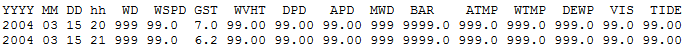
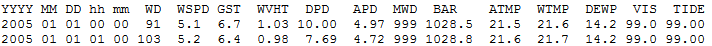
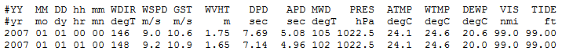
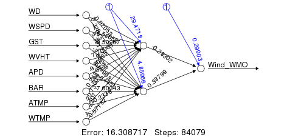

##Introduction

The National Oceanographic and Atmospheric Administration (NOAA) is a federal agency that is responsible for overseeing information and research related to the ocean and weather.  Some of the [research and services](http://www.noaa.gov/about-noaa.html) they perform in the atmospheric realm include weather and storm forecasting.  To aid the National Weather Service (a subdivision of NOAA) in forecasting and assessing previous forecasts, NOAA runs the [National Data Buoy Center](http://www.ndbc.noaa.gov/tour/virtr1.shtml ) which operates an array of buoys and observation stations situated along the coasts of the United States and scattered throughout the oceans.  These buoys collect ocean and atmospheric data for use in prediction, modelling, and assessment, and the data for all buoys and stations can be found online at the [NDBC website](http://www.ndbc.noaa.gov/tour/virtr1.shtml).

Separately, NOAA also controls the National Climatic Data Center, which contains the [International Best Track Archive for Climate Stewardship](https://www.ncdc.noaa.gov/ibtracs/) (IBTrACS).  This archive maintains data on cyclones around the globe, with [records](https://www.ncdc.noaa.gov/ibtracs/index.php?name=browse ) dating back to 1842.  All data is available at the IBTrACS website, and comes from data collected by organizations and agencies all over the world.

Recently, Hurricane Patricia proved to be the strongest hurricane [ever recorded](http://www.weather.com/safety/hurricane/news/hurricane-patricia-mexico-no-deaths), and although it fortunately caused no deaths and less destruction than anticipated, it serves as an important reminder of the importance of monitoring weather.  As storms like Patricia threaten coastal communities each year, studying and understanding atmospheric conditions is a crucial field.  For this reason, we are interested in the ability of NOAA buoys to estimate the severity of nearby storms, to see how well buoy measurements can be used in measuring storm parameters.

Currently, a wide range of technology is used to measure storm winds (see [this](http://webcache.googleusercontent.com/search?q=cache:yUnCRsmeHooJ:https://www.wmo.int/pages/prog/drr/projects/Thematic/HazardRisk/2013-04-TechWks/Documents/TCs/TropicalCycloneProg/Tropical_Cyclones_v1.0.docx+&cd=1&hl=en&ct=clnk&gl=us) report from the World Meteorological Organization (WMO) for the information in this paragraph).  These include radar and remote sensing technologies as well as measuring devices on aircraft, buoys, and ships.  Information gathered by buoys contributes to storm measurements, but plays a small role, especially as there are large stretches of water which do not contain buoys.  We are interested in evaluating the ability of buoy measurements by themselves to estimate nearby sustained winds.

To do so, we will gather IBTrACS data on storms in the North Atlantic and combine it with buoy data from the NBDC.  Each row in the IBTrACS data is a location in space and time, and contains a measured windspeed.  We will match each row with nearby NOAA buoys, which have a variety of oceanic and atmospheric measurements including wind measurements, and see how well the buoy measurements at that time can estimate the storm windspeed.  Estimation will be attempted using neural networks and random forests, and we will investigate the ability of these models to estimate sustained wind speed.

##Data Collection

For our project, we are combining meteorological data with recorded storm observations in the North Atlantic.  To gather this data, we must scrape both storm data and meteorological data and then integrate these two datasets.  The storm data came from the NOAA [International Best Track Archive for Climate Stewardship](http://www.ncdc.noaa.gov/ibtracs/index.php?name=ibtracs-data) (IBTrACS) , and the meterological data comes from the NOAA [National Data Buoy Center](http://www.ndbc.noaa.gov/historical_data.shtml), where we are using historical standard meterological data collected by buoys.

To integrate these two dataset, we wanted to take meteorological buoy data that measured different variables of each storm in the storms dataset.  First we noted that we wanted each row of our dataset to represent a portion of the storm with a location in space and time.  So each row was a storm with a specific latitude, longitude, time, and date.  We then would find the buoys within a certain radius of this storm location/time and compute the average meterologial conditions (such as averaging the windspeed measured by several buoys nearby this storm location/time).  

###First Collect Storm Data

However, first we must bring in and clean the data on the storms from NOAA IBTrACS.  NOAA [International Best Track Archive for Climate Stewardship](http://www.ncdc.noaa.gov/ibtracs/index.php?name=ibtracs-data) has datasets on the storms that are sorted by the year the storm was in.  First we downloaded all the csv files in the years we wanted (2000 to 2015).  An example of how the storm data by year that IBTrACS has as csv files is Figure 1.   


  

Figure 1. IBTrACS Storm Data By Year  


 We saved these files as storm*year* on our computer.  Each dataset looks approximately like Figure 2.
  

Figure 2. IBTrACS Storm Data Original File  


After saving the datasets as storm*year*, we removed the first row (IBTrACS -- Version: v03r07 ) and the third row that gives units for the variable, so when we read in the csv files the header would appear correctly.

To read in the csv files for the storm data, we used a for loop that read in each storm data set and put it in a list of datasets called allStorms.  Then for each dataset storm*year*, a for loop was used to discard all columns after 19 since these were not variables of interest and often had lots of missing data (labelled as -999).  

Finally, a for loop was used to removed all rows in each storm*year* dataset that has missing data (-999) for latitude and longitude.  These cleaner datasets were assigned to the list cleanStorms.  We wanted to combine this list of all the storm datasets into one large dataset of all the storms from 2000 to 2015.

So first, we checked to make sure the order of all the variables were the same between datasets.  Then combined them into one large dataset called finalStorms.  We further cleaned finalStorms by changing the ISO\_time variable to ymd\_hms using lubridate.  Then we selected out the information we wanted by keeping the variables Basin, Serial\_Num, Latitude, Longitude, time.  We filtered by Basin NA to get storms in the North Atlantic basin, which is where the buoys (the meterological data) are located.


```{r, message=FALSE}
# all the packages needed for the data scraping and cleaning
require(dplyr)
require(tidyr)
require(geosphere) # to calc distances between latitude/longitude of points
require(lubridate) # standardize dates and times
require(XML) # scrape buoy lat/long data from web

```


```{r, eval= FALSE}

# data from http://www.ncdc.noaa.gov/ibtracs/index.php?name=ibtracs-data
# ftp://eclipse.ncdc.noaa.gov/pub/ibtracs/v03r07/all/csv/year/

# save portion of name of storm files that differed between files
stormYearsFile <- c("2000.csv","2001.csv","2002.csv","2003.csv","2004.csv","2005.csv","2006.csv","2007.csv","2008.csv","2009.csv","2010.csv","2011.csv","2012.csv","2013.csv","2014.csv", "2015.csv")

# create a list to store these storm datasets in separately
allStorms <- vector("list",length(stormYearsFile)) 

# pull in csv files and assign each dataset to a different section of the list
for(i in 1:length(stormYearsFile)){
  allStorms[[i]] <-read.csv(paste("~/Comp-Stats-Project/storm",stormYearsFile[i], sep=""))
}

# only keep the first 19 variables (columns)
for(i in 1:length(allStorms)){
  allStorms[[i]] <- allStorms[[i]][,1:19]
}

# store cleaner data in new list of datasets
cleanStorms <- vector("list",length(stormYearsFile))

# remove all rows that have -999 (missing data) as latitude or longitude
for(i in 1:length(allStorms)){
  cleanStorms[[i]] <- allStorms[[i]]%>% 
    filter(Latitude!=-999) %>% 
    filter(Longitude!=-999)
}

# check all storms datasets have same order of variables
checkingStorms <- c()
for(i in 2:length(cleanStorms)){
  checkingStorms[i-1] <- sum(names(cleanStorms[[1]]) == 
                             names(cleanStorms[[i]]))
}


# combine all storm datasets into 1 big dataset
finalStorms <- cleanStorms[[1]]
for(i in 2: length(cleanStorms)){
  finalStorms <- rbind(finalStorms, cleanStorms[[i]])
}

#add new column of time in ymd_hms type setup using parse date time fuction
finalStorms <- finalStorms %>% mutate(time = parse_date_time(ISO_time, "%m%d%Y %H%M")) %>%
  filter(year(time) != 1999) # dont want storms in 2000 season that start in 1999

# only save variables we want and choose storms in Basin NA (north atlantic)
stormsNorthAtl <- finalStorms %>% 
  dplyr::select(Basin, Serial_Num, Latitude, Longitude, time, Wind.WMO., Wind.WMO..Percentile) %>%
  mutate(BasinChar = as.character(Basin))%>% filter(BasinChar == " NA") 

names(stormsNorthAtl)[6] <- "Wind_WMO"  # in knots
names(stormsNorthAtl)[7] <- "Wind_WMO_Perc" # in percentiles

# save dataset for use later
dput(stormsNorthAtl, "stormsNorthAtl.txt")

```

```{r}

stormsNorthAtl <- dget("stormsNorthAtl.txt")
head(stormsNorthAtl,3)

```

###Getting Buoy Locations (combining Storm and Buoy Data)

When we integrate the storm and buoy data, ideally we want each row to be a storm at a specific time and location (latitude/longitude) with meteorological conditions averaged over all the buoys near the storm location/time.  For instance we want our data to look like this:


Figure 3.  Example of what we want our data to look at.  Note: data in this example is not accurate.  

However, to do this, we need to get the meteorological data in buoys for the area around the storm time/location.  To do this, we will match the year of the storm row to the NOAA buoy records and determine all the buoys that have historical meterological data at this year.  Then we will determine which buoys that have data are closest to the storm location (latitude and longitude).  We will do futher refinement to only obtain data for buoys close enough to the storm location and around the same time. 

Our very first step will be to determine which NOAA buoys are in the correct location and have the information we need, and then make a list of those buoys.

A list of all stations can be found at [http://www.ndbc.noaa.gov/to_station.shtml](http://www.ndbc.noaa.gov/to_station.shtml); this is what part of the page looks like:


Each link is a different buoy number, and clicking on it will take you to the page for that specific buoy.  The page also contains lots of non-buoys stations, such as oil rigs, which we will have to deal with later. Let's look at one of the buoys, say [41046](http://www.ndbc.noaa.gov/station_page.php?station=41046). If we scroll down to the bottom of the page, we get a link to historical data:


Clicking on this link takes us to a page ( [http://www.ndbc.noaa.gov/station_history.php?station=41046](http://www.ndbc.noaa.gov/station_history.php?station=41046) ) with historical data, including standard meteorological data:


So buoy 41046 has historical meteorological data for 2007 - 2014, which is great for us!  Here's what the 2007 data ( [http://www.ndbc.noaa.gov/view_text_file.php?filename=41046h2007.txt.gz&dir=data/historical/stdmet/](http://www.ndbc.noaa.gov/view_text_file.php?filename=41046h2007.txt.gz&dir=data/historical/stdmet/) ) looks like:


But to get it, we would have to click on each link for each year, which takes us to a text file.  Since there are many buoys and many different years, getting all the data manually would be tedious and unproductive.  Instead, we will write some code to scrape it from the NOAA website.  First, we take all of the buoy numbers from [http://www.ndbc.noaa.gov/to_station.shtml](http://www.ndbc.noaa.gov/to_station.shtml). The source for the webpage is in HTML; each hyperlink has a specific tag, and since each buoy number is a hyperlink on the page we will grab all of the hyperlinks.  The package XML allows us to do this; the htmlTreeParse() function converts the HTML content of the webpage to a useful structure, and then xpathApply() is used to select all the hyperlinks by selecting for the hyperlink tags.

```{r, eval = FALSE}

# We'll use the XML package to get info from web pages

# Read and parse HTML file
buoylist.html = htmlTreeParse('http://www.ndbc.noaa.gov/to_station.shtml',
                         useInternal = TRUE)
# make a vector of each hyperlink
buoylist.text = unlist(xpathApply(buoylist.html, "//a/@href"))

```

We now have a vector containing each hyperlink.  To get all the ones corresponding to buoys, we use the grep() function from the base package to find matches to the string pattern "station=" in the vector. Having found the indices of strings that contain the pattern "station=", we pull out the station number from each of those strings by selecting the substring of length 5 that start immediately after the "=" sign:

```{r, eval = FALSE}

# indices of hyperlinks that correspond to NOAA observation stations
hrefIndices <- grep("station=", buoylist.text)

# create vector to hold the buoy numbers
buoyNums <- c()

for(i in 1:length(hrefIndices)){
  href <- hrefIndices[i]  # look at each buoy index in turn
  refString <- buoylist.text[href]  # look at hyperlink at that index
  # substring starts after '=' sign
  startind <- unlist(gregexpr('=',refString)) + 1  
  # take substring of length 5, starting right after '=' sign
  buoyNums[i] <- substr(refString, startind, startind + 4)
}

```


Why do we only look at strings of lengths five? It turns out that's how long a buoy ID number is, according to the NOAA documentation at [http://www.ndbc.noaa.gov/staid.shtml](http://www.ndbc.noaa.gov/staid.shtml) :


And in fact, as we are only interested in buoys in the North Atlantic, this documentation tells us that we need only consider those buoy numbers beginning with 41, 42, or 44, so let's select just those values from the vector of buoy numbers we just created:

```{r, eval = FALSE}

buoyNums <- buoyNums[substr(buoyNums, 1,2) %in% c("41", "42", "44")]

```

Now that we have a list of buoys, we want to know the location of each buoy.  Each buoy has its latitude and longitude on the page reached by following its hyperlink.  For example, if we click on buoy [42042](http://www.ndbc.noaa.gov/station_page.php?station=42042), then we can see that its latitude and longitude are 29.880 N, 88.320 W :


Since we don't want to have to manually collect these latitude and longitude values, we will again scrape them from the HTML source for each buoy webpage.  The address for buoy 42042 is [http://www.ndbc.noaa.gov/station_page.php?station=42042](http://www.ndbc.noaa.gov/station_page.php?station=42042), and in fact every buoy has the same address up until the final 5 characters, which hold the buoy ID number. Since we have a vector containing each buoy number, we can loop through that vector and paste each number in the vector into the basic address form. Then, we can find the latitude and longitude on the HTML for that page.

```{r, eval = FALSE}

lat <- c() # vector to hold buoy latitudes
lon <- c() # vector to hold buoy longitudes

# loop over all the buoy numbers we collected
for(i in 1:length(buoyNums)){
  
  # get the HTML source for each buoy page
  doc.html = 
    htmlTreeParse(paste('http://www.ndbc.noaa.gov/station_page.php?station=',
                        buoyNums[i], sep=""),
                           useInternal = TRUE)
  # get all the paragraph (<p>) elements from the HTML
  doc.text = unlist(xpathApply(doc.html, '//p', xmlValue))
  
  # search for ' N ', which will appear immediately after the latitude
  startind1 <- min(unlist(gregexpr(' N ',doc.text[1]))) - 6 # latitude start
  stopind1 <- startind1 + 5 # latitude end
  startind2 <- stopind1 + 4 # longitude start
  stopind2 <- startind2 + 5 # longitude end
  
  # store the latitude and longitude in the vectors we made
  lat[i] <- as.numeric(substr(doc.text[1], startind1, stopind1))
  lon[i] <- as.numeric(substr(doc.text[1], startind2, stopind2))
}

# remove those which are missing latitude and longitude
buoyNums <- buoyNums[-which(is.na(lat))]
lat <- lat[-which(is.na(lat))]
lon <- lon[-which(is.na(lon))]

```


Note: When you run the above chunk you get NA introduced by coercion, which is removed when we removed the buoys that are missing latitude and longitude.
In the last few lines, we've removed those buoys without latitude and longitude information.  Since we need the buoy locations to match them up with storms data, we can't use a buoy if we don't have its location.

We are interested in the years 2000 - 2015.  Some of the buoys we selected have data for some of these years, while some do not have data for any of these years (for example, old buoys from the '70s and '80s). So, we need to go through each buoy and determine which years it has data for.  The result will be a matrix which contains the number of each buoy, its location, and a boolean variable for each year from 2000 to 2015 which is TRUE if it has data for that year and false otherwise. 

To get the data, we note that the historical data for each buoy can be found at an address that differs only in the buoy number (again, this is the last 5 characters).  For example, for buoy 42042 the address is [http://www.ndbc.noaa.gov/station_history.php?station=42042](http://www.ndbc.noaa.gov/station_history.php?station=42042). Here's what that webpage looks like:


We want to know for which years the buoys have standard meteorological data.  For buoy 42042, as we can see in the image, data only exists for year 2000. We'll use our HTML scraping tools again to find the "Historical Data" list in the HTML source. Then, since standard meteorological data is the first item in the historical data list, we select all the numbers in that item.

```{r, eval= FALSE}

# interested in years 2000 - 2015
stormYears <- seq(from=2000, to=2015, by=1)

# make a matrix to hold buoy number, latitude, longitude, and 
#  indicator variables for which years it has data
buoyLocsAndYears <- as.data.frame(matrix(nrow=length(buoyNums), ncol=19))
names(buoyLocsAndYears) <- c("BuoyNumber", "Latitude", "Longitude", 
                             paste("year", as.character(stormYears), sep=""))

# loop over all the buoys
for(i in 1:length(buoyNums)){
  # get HTML source for the station history for each buoy in turn
  historical.html <- 
    htmlTreeParse(paste('http://www.ndbc.noaa.gov/station_history.php?station=',
                        buoyNums[i]),
                                   useInternal = TRUE)
  
  # find all the list (<li>) elements in the HTML source
  historical.text = unlist(xpathApply(historical.html, '//li', xmlValue))
  
  # find the list element that is 'Historical data'
  histString <- historical.text[grep('Historical data', historical.text)]
  
  # take the numbers from the first entry of the 'Historical data' list
  # these are the numbers that lie between the first and second '\n' substrings
  endpoints <- unlist(gregexpr('\n', histString))[c(1,2)]
  yearString <- substr(histString, endpoints[1]+2, endpoints[2]-1)
  
  # split the string (by empty spaces) to make each year a separate 
  #  element of a numeric vector
  yearsOfHistData <- as.numeric(unlist(strsplit(yearString, " ")))
  
  # for each year 2000 - 2015, test if it is in the set of years for that buoy
  #  save the results in the matrix row corresponding to that buoy
  buoyLocsAndYears[i, 4:19] <- stormYears %in% yearsOfHistData
}

```


We now have a matrix that contains the years of data for each buoy. We also want the number and location, so let's add those.  So that our latitude and longitude will be simply numeric, without the need for degrees N or W, we will use the format (found also in the IBTrACS storms data) of assigning a sign to latitude and longitude instead of a compass direction. Latitudes north of the equator and longitudes east of the prime meridian are positive, while latitudes south of the equator and longitudes west of the prime meridian are negative.  So, for example, 35.56 N 54.78 W becomes the pair (35.56, -54.78). This change is helpful both to match with the IBTrACS data and to avoid the need for character strings in storing our location data.

```{r, eval = FALSE}

# store buoy number in matrix
buoyLocsAndYears$BuoyNumber <- buoyNums 

# store latitude in matrix (all latitudes are N of equator)
buoyLocsAndYears$Latitude <- lat 

# store longitude in matrix (all longitudes are W of prime meridian)
buoyLocsAndYears$Longitude <- -1*lon

# save table for use later
dput(buoyLocsAndYears, "buoyLocsAndYears.txt")

```

```{r}

buoyLocsAndYears <- dget("buoyLocsAndYears.txt")
head(buoyLocsAndYears,3)

```


However, there is a problem with the buoy collection we've just performed: some of the buoys do not have the data we need! There are two ways this can happen, either the buoy simply does not have data for the years 2000 - 2015 (its an old buoy) or it is not really a buoy.  "But how can it not be a buoy?" you ask, "since we selected the buoy numbers following the NOAA ID numbering system?" Well, as we briefly hinted at above, NOAA has information on a whole variety of stations (e.g., oil rigs), not just buoys.  The numbering system applies to ALL stations, and so we inadvertently selected a bunch of other types of station as well.  Like station number 42386, which belongs to Chevron:


We need to remove the buoys that do not have the data we want.  The way we will do this is to actually try and get the data, and see if we can.  It turns out that each year of standard meteorological data is found in a text file at a web address with the same format, differing only by buoy ID number and the year.  For example, data from 2014 for buoy 42036 is found at [http://www.ndbc.noaa.gov/view_text_file.php?filename=42036h2014.txt.gz&dir=data/historical/stdmet/](http://www.ndbc.noaa.gov/view_text_file.php?filename=42036h2014.txt.gz&dir=data/historical/stdmet/). For each buoy, we will check each year to see whether it has standard meteorlogical data for that year.  If it does for any of the years, we will store the buoy number.  We use the try() function to attempt to get data from each of these web addresses, and we make 10 attempts to get the data.  If we fail after 10 attempts, we move on to the next year.

```{r, eval= FALSE}

# final dataframe of buoy locations and years of data 
# will be called buoyLocationsFixed

buoyLocationsFixed <- buoyLocsAndYears # dataframe that needs cleaning

# numeric vector to hold the buoy numbers we want to keep
isABuoy <- c()

# loop overal all buoys
for(k in 1:(nrow(buoyLocationsFixed))){
  
  # this is TRUE until we find data for the buoy in one of the years 2000 - 2015
  notFoundDataYet <- TRUE
  
  # loop over each year 2000 - 2015
  for(j in 4:(ncol(buoyLocationsFixed))){
    buoyYear <- 1996 + j
    
    # if the historical data exists, it will be at this site
    site <- paste("http://www.ndbc.noaa.gov/view_text_file.php?filename=",
                  buoyLocationsFixed$BuoyNumber[k],
                  "h",buoyYear, ".txt.gz&dir=data/historical/stdmet/", sep ="")
        
    if(notFoundDataYet){  
      # call in buoy data with try command in while loop
      i <- 1 # 1 = failed to connect, 2 = managed to connect
          
      # count the number of times we try and fail to get the data
      countError <- 0
          
      # while we haven't connected, and have tried fewer than 10 times,
      #  try to connect
      while (i < 2 & countError < 10){
        data <- try(read.table(site,sep="", fill=TRUE, header=TRUE,
                               comment.char=""), silent=TRUE)
        
        # if we get a try-error, we failed.  Increase the number of failures
        #  and go back to the beginning of the while loop
        if (class(data) == "try-error") {
          countError = countError + 1
          next
        } else {  # otherwise, we managed to connect, so data exists
          i <- i + 1  # increase i to stop entering the while loop
        }
      }
      
      # if we got a try error all 10 attempts, the class of our 'data'
      #   while be 'try-error', in which case we do nothing
      # otherwise, we got data and we store the buoy number as a good one
      # then set notFoundDataYet to FALSE so that when we look at the next 
      #   year we don't have to try to find data
      #   (if the buoy has data for one year, it doesn't matter 
      #    about the others)
      if(class(data) != "try-error"){
        isABuoy <- c(isABuoy, buoyLocationsFixed$BuoyNumber[k])
        notFoundDataYet <- FALSE
      }
        
    }
  }
  
}

```

Now we'll store the list of buoy numbers that we want to keep, then use the filter() function to select the rows of the buoy locations and years matrix for which the buoy number is in the list of those that we want to keep. Finally, we store the fixed version (buoyLocationsFixed) of the buoy matrix, which contains the ID number, latitude, longitude, and year indicator variables for only those buoys that have the data we want.

```{r, eval = FALSE}
# buoy locations (lat/long) filtered by those that are buoys (i.e. not oil rigs) and that have data
buoyLocationsFixed <- buoyLocationsFixed %>% filter(BuoyNumber %in% isABuoy)

# save the data for use later
dput(buoyLocationsFixed, "buoyLocationsFixed.txt")

```


```{r}

buoyLocationsFixed <-dget("buoyLocationsFixed.txt")

head(buoyLocationsFixed,3)

```


###Combining Storm and Buoy Data (calculating weighted means for buoy data)

Now that we have a dataset *buoyLocationsFixed*  of all the buoys with their locations (latitude/longitude) and that tells us which year each buoy has data for, we can now combine this with the storm dataset *stormsNorthAtl*.

To integrate the storms and buoy data, we want take each row of the storms dataset (which is a storm at a time and location) and compute the average meterological conditions around the storm time/location as measured by buoys.

To do this we run a for loop over all the rows in the *stormsNorthAtl* dataset and find the set of buoys within 500 km of the storm location for that row.  We determine the weather variables (i.e. waveheight, air temp) of these buoys at the time (day month year hour) of this storm row, and we average these variables over all the buoys.


We are going to walk you through the data collection of buoy data for one row of the *stormsNorthAtl* dataset, which is one loop of the for loop below.

Let us call the first row in the *stormsNorthAtl* dataset StormRow1 which is in 2000.

```{r}
head(stormsNorthAtl,1)

```


First we find the year of StormRow1 (2000), and filter the *buoyLocations* dataset so that we only have buoys that contain historical data in that year.  Then we compute the distance of all these buoys to the latitude and longitude location of StormRow1.  We then filter by distance so we are left with the buoys that are within 500 km of StormRow1 location.  We pull out these buoy Numbers to feed into another loop to pull in the data for each of these buoys at the year of StormRow1 (in this case 2000).  

To pull in the data for these buoys, call them Buoy1,..., BuoyN, near StormRow1 we enter another for loop.  Note that in pulling in the buoy data from the NOAA website we can run into errors such as 404 Error Not Found or port 80 connectivity issue.  This is likely due to problems with the R studio server connecting to the NOAA server.  To fix some of these issues, we used a try loop that tried to pull in data 10 times, but after 10 errors moved on to the next buoy.


The first time through this loop, we pull in the buoy data for Buoy1 and clean it up to standardize it.  We need to standardize the resulting Buoy1 dataset because the NOAA buoy data between 2000 to 2004, 2005 to 2006, and 2007 to 2015 all had slightly different formats.  We standardized them to look like the data tables in 2000.  


Buoy Dataset Format 2000 to 2004.  


Buoy Dataset Format 2005 to 2006.  


Buoy Dataset Format 2007 to 2015. 

Then we took the Buoy1 dataset and filtered by time of StormRow1 so that the only data left was Buoy1 data that was at the same year, month, day, hour as StormRow1.  We took this Buoy1 data and added on the buoy number to it and saved it in a vector matrix called matchingBuoys.

We then pulled in the data for Buoy2, ..., BuoyN and cleaned it up, filtered by StormRow1 time, and added them on to matchingBuoys (used r bind to sequentially add the data from each buoy onto the data from the buoys before it).

The end result was a data frame called *matchingBuoys* where each row was the data from a buoy within 500 km of StormRow1 and in the same year, month, day, hour as StormRow1.  Then we join *matchingBuoys* to a buoyDists so now each row of *matchingBuoys* has distance of that buoy from StormRow1.  Then we clean up the data by changing missing data 99, 999, and 9999 to NAs and averaging rows that are the same buoy number.  We average the rows with the same buoy number since we assume these weather measurement must have occurred at times very close together and are likely very similar.  We do not want several weather measurements from the same buoy that are very similar over weighted the average of all the buoy weather measurements.

We then calculated the weighted mean of each weather variable over all the buoys (Buoy1, ..., BuoyN) for StormRow1.  We weight the mean by 1/distance, so that buoys further away from StormRow1 contribute less to the mean of the weather variables.  We then add rowNum (the row number from the *stormsNorthAtl* dataset) onto the weighted means.

We then put this row of weighted weather variable means into the data frame *weightedMeans* that after the complete loop will contain all of the weighted Means data.  So after running the full loop, *weightedMeans* will contain weighted averages for weather data for all storm rows in *stormsNorthAtl* dataset that have buoys within 500 km of them.

We then added the row number onto *stormsNorthAtl* so we could join the datasets resulting in *stormsWithBuoyData* that had for each row a storm at a specific location and time with average weather variables (calculated from nearby buoys).


```{r, eval = FALSE}

# time how long this process takes
Sys.time()

# table of buoy num, lat, long, and TRUE/FALSE if have data in years 2000 to 2015
buoyLocations <- dget("buoyLocationsFixed.txt") 

# vector of weighted means of weather variables
weightedMeans <- c()

# loops over every row in stormsNorthAtl dataset
for(k in 1:nrow(stormsNorthAtl)){
  
  # indicates whether this storm row has any buoys near it with data around the time of the storm row
  stormRowHasBuoyData = FALSE
  
  # the storm row we are finding avg weather variables for
  theRow <- stormsNorthAtl[k,]
  
  #column num that corresponds to variable yearX in buoyLocations file
  #yearX is the year of the storm for this row
  yearColNum <- which(names(buoyLocations)==paste("year", year(theRow$time), sep=""))
  
  # only take buoys w data from yearX
  buoyLocsThatYear <- buoyLocations %>% filter(buoyLocations[,yearColNum] == TRUE)
  
  # longitude and latitude of this storm row
  stormCoords <- c(theRow$Longitude, theRow$Latitude)
  
  # function to compute dist from storm coord to buoy (buoy parameter takes long/lat of buoy)
  computeDistanceTo <- function(buoy){
    return(distGeo(stormCoords,buoy))
  }
  
 
  # computes distances of buoys with data in yearX to the storm
  # filter so we only have buoys within 500 km of storm 
  buoyDists <- buoyLocsThatYear %>% mutate(distToStorm = 
             apply(cbind(Longitude, Latitude), 1, computeDistanceTo)) %>%
    filter(distToStorm <= 500000) %>% dplyr::select(BuoyNumber, distToStorm)
  
  # save this buoy numbers so we can get their datasets
  buoyNumber <- buoyDists$BuoyNumber
  buoyYear <- year(theRow$time) # yearX that storm was in
  
  # if there are buoys near the storm, pull in their data
  # otherwise do nothing and go back through for loop over
  # rows of storm data
  if(length(buoyNumber)!= 0){
    
    # dataset where we store all the buoy data for buoys near the storm
    matchingBuoys <- as.data.frame(matrix(nrow = 1,ncol =19))
    names(matchingBuoys) = c("YYYY", "MM", "DD", "hh", "WD", "WSPD", "GST", 
                             "WVHT", "DPD", "APD", "MWD", "BAR", "ATMP" ,
                             "WTMP","DEWP" ,"VIS", "TIDE", "ymdday", "BuoyNumber")
    
    #loops over all buoys near this storm row and pulls in the buoy datasets
    for(j in 1:length(buoyNumber)){
      # url for .txt with buoy data for a certain year
      site <- paste("http://www.ndbc.noaa.gov/view_text_file.php?filename=", 
                    buoyNumber[j], "h", buoyYear, ".txt.gz&dir=data/historical/stdmet/", sep ="")
    
      # call in buoy data with try command in while loop
      
      # count the number of times we try and fail to get the data (due to 404 Errors etc)
      countError <- 0
      i <- 1
      while (i < 2 & countError < 10){ # keep trying to get data unless get 10 error messages, then give up
        data <- try(read.table(site,sep="", fill=TRUE, header=TRUE, comment.char=""), silent=TRUE)
        if (class(data) == "try-error") { # e.g. try error due to 404 Error
          countError = countError + 1
          next # goes back to while loop
        } else {
          i <- i + 1 # got data, exit while loop
        }
      }
    
      # we try to get the data 10 times; if we fail every time,
      # the data will be of class try-error.  
      # if the data is actual buoy data, go on to clean up and average the buoy data
      # if we could not get data (is try error), go onto next buoy Number in loop 
      # and try to pull in that data
      if(class(data) != "try-error"){
        # standardize the buoy datasets variable names 
        
        # clean up if buoy data .txt has comment sign (#) -- 2007 and later
        if(length(grep("X.",names(data)))>0){
          # ie names variable X.YY to YY
          names(data)[grep("X.",names(data))] <-
            substr(names(data)[grep("X.",names(data))],
                   start=3,nchar(names(data)[grep("X.",names(data))]))
          # removes row of variable units
          data <- data[-1,]
          
          # change YY to YYYY, WDIR to WD, PRES to BAR
          names(data)[grep("YY", names(data))] <- "YYYY"
          names(data)[grep("WDIR", names(data))] <- "WD"
          names(data)[grep("PRES", names(data))] <- "BAR"
          
          # remove mm (min col)
          data <- data[,-grep("mm", names(data))]
        } else if(buoyYear>2004) { # only need to remove min to standardize
          # remove mm (min col)
          data <- data[,-grep("mm", names(data))]
        }
          
        # make everything numeric
        data <- as.data.frame(apply(data[,1:(length(data))], 2, as.numeric))
          
        # make new variable ymd_hms w lubridate (set all min 00 and sec to 00)
        nextRow<-data%>%mutate(ymdday=ymd_hms(paste(YYYY,"-", MM,"-",DD, 
                                                    "-", hh, "-", 00, "-", 00)))%>%
          filter(ymdday == theRow$time) #only want data at time matching storm
        
        # if row(s) of buoy data at storm time is not empty, add buoy number onto row  
        if(nrow(nextRow) > 0){
          # indicates this storm row has buoy data at this location and time
          stormRowHasBuoyData = TRUE 
          nextRow <- as.data.frame(c(nextRow, buoyNumber[j]))
          names(nextRow)[ncol(nextRow)] <- "BuoyNumber"
          
          # matchingBuoys holds data for all the buoys near the storm
          # each row of matchingBuoys is a buoy at a certain time
         
          if(j==1){
            # assign first row of buoy data to empty matchingBuoys (to get formatting correct)
            matchingBuoys <- nextRow
          } else {
            # rbind on other nextRows (rows of buoy data) sequentially
            matchingBuoys <- rbind(matchingBuoys, nextRow)
          }
            
        }
      
      }
   
    }
    
    # if this storm row has buoys near it with data around the time of the storm
    # calculate weighted means of this buoy data
    if(stormRowHasBuoyData){
      # join buoy data for that storm row to distance from buoy to storm
      matchingBuoys <- matchingBuoys %>% 
        mutate(BuoyNumber = as.character(BuoyNumber))%>%
        left_join(buoyDists, by = "BuoyNumber")
      
      # converting 999 and 99 and 9999 (missing data) to NA
      matchingBuoys[,c(6:10, 16:17)][matchingBuoys[,c(6:10, 16:17)] == 99] <- NA
      
      matchingBuoys[,c(5, 11, 13:15)][matchingBuoys[,c(5, 11, 13:15)] == 999] <- NA
      
      matchingBuoys[,12][matchingBuoys[,12] == 9999] <- NA
      
      # average rows with same buoy number, with na.rm = TRUE 
      # assume buoy data at close to same time for the same data is repetitive, 
      # so average by buoy Number to prevent overweighting
      matchingBuoys <- matchingBuoys %>% group_by(BuoyNumber) %>%
        summarize_each(funs(mean(., na.rm=TRUE)))
      
      # change to data frame to get formatting correct
      matchingBuoys <- as.data.frame(matchingBuoys)
      
      # function to calculate weighted averages (weighted inversely by distance of buoy to storm row)
      weightedByDistance <- function(x){
        return(weighted.mean(x, w= 1/(matchingBuoys$distToStorm), na.rm = TRUE))
      }
      
      # calculates weighted avgs of buoy variables for each storm row
      meansForRow <- apply(matchingBuoys[,c(6:18)], 2, weightedByDistance)
      
      # if weighted avgs not all NaN then add on corresponding storm rowNum
      if(sum(meansForRow, na.rm=TRUE) > 0){
        meansForRow <- c(meansForRow, k)
        names(meansForRow)[length(meansForRow)] <- "rowNum"
        meansForRow <- as.data.frame(t(as.matrix(meansForRow))) # reformatting
        
        # weightedMeans is a dataframe that has weather variables that are weighted avgs of weather variables
        # from buoys near the storm row for all the storm rows
        if(length(weightedMeans) == 0){ 
          weightedMeans <- meansForRow # assign first row of weighted weather variable to empty vector for correct formatting
        } else {
          weightedMeans <- rbind(weightedMeans, meansForRow) # rbind on weighted weather variables for other storm rows 
        }
      }
    }
  }
}

# to determine when loop ended
Sys.time()

# add row number to storms dataset to allow joining
stormsNorthAtl <- stormsNorthAtl %>% mutate(rowNum = as.numeric(rownames(stormsNorthAtl)))

# added weighted means data onto storms data (only keep storm rows that has buoy data )
stormsWithBuoyData <- left_join(weightedMeans, stormsNorthAtl, by="rowNum")

# save for use later
dput(weightedMeans, "weightedMeans.txt")
dput(stormsWithBuoyData, "stormsWithBuoyData.txt")

# Results
# Start time: 2015-12-10 21:03:42 PST
# End time: 2015-12-11 09:39:46 PST
# Warnings: 49 warnings of form "In file(file, "rt") : unable to connect to 'www.ndbc.noaa.gov' on port 80."

```

Note: From the print outs, this loop takes about 12.5 hours. However, the data we pull in from running this loop different times can be slightly different depending on the connectivity problems (port 80, 404 Not Found).

```{r}

weightedMeans <- dget("weightedMeans.txt")
stormsWithBuoyData <- dget("stormsWithBuoyData.txt")

# end result of dataset of weighted weather variables for each storm row
# (except skips storm rows that do not have buoy data at that time/location)
head(weightedMeans, 4)

# combined datasets
head(stormsWithBuoyData, 4)

```

The output shown above is the final combination of the storms and buoys data.  As desired, each row represents one location of a storm at a specific time.  Variables measured by buoys within 500 km have been averaged (and weighted by distance) to produce a value for each buoy variable.  The variables shown, their source (NOAA buoy data or IBTrACS storms data), and their units, are:

- WD (wind direction); buoy data; degrees clockwise from true North
- WSPD (wind speed); buoy data; m/s averaged over 8 minute period
- GST (gust); buoy data; peak 5 or 8 second gust speed in m/s measured during the 8 min period
- WVHT (wave height); buoy data; meters
- DPD (dominant wave period); buoy data; seconds
- APD (average wave period); buoy data; seconds
- MWD (measurement of wave direction); buoy data; degrees from true north, increasing clockwise
- BAR (sea level pressure); buoy data; hecto-Pascals (hPa)
- ATMP (air temperature); buoy data; degrees Celsius
- WTMP (water temperature); buoy data; degrees Celsius
- DEWP (dewpoint); buoy data; degrees Celsius
- VIS (visibility); buoy data; nautical miles
- TIDE (water level above or below 'mean lower low water'); buoy data; feet
- rowNum (row number); created variable that numbered the rows in the storms from which our weighted means were calculated so we could later join the weighted average buoy measurements with the original storm rows
- Basin (categorical variable for ocean basin); storm data; we only look at Basin = NA (North Atlantic)
- Serial_Num (storm serial number); storm data; unique identification for each storm to link all rows belonging to that storm
- Latitude; storm data; degrees (positive if above equator, negative if below)
- Longitude; storm data; degrees (positive if East of prime meridian, negative if West)
- time; storm data; time and date information from the storms data
- Wind_WMO (maximum sustained wind gust); storms data; knots
- Wind\_WMO\_perc (percentile of maximum sustained wind gust); storms data; percentile (in relation to all the maximum sustained wind gusts in the column)
- BasinChar (character string for ocean basin); storms data; variable we created to ensure basin names were in character string format

The goal of our project is to assess the ability of the variables measured by the buoys to estimate the maximum sustained wind gust (Wind\_WMO) in each storm row.  To do so, we will build two models with these variables as the predictors and Wind\_WMO as the response.


### Assessing Data (Neural Networks and Trees)

We were interested in seeing how Neural Networks could perform on our data.  Neural networks have been used for analyzing complex problems involving pattern recognition.  We were curious how neural networks could perform on our data, given that many of the variables were likely correlated.

It has been found that redundancy in input variable selection can be a problem in neural networks since it can result in more local optima for the error function.  Thus, we will also be comparing our results to random forests which deal with variable correlation and interaction well [http://cdn.intechopen.com/pdfs-wm/14882.pdf](http://cdn.intechopen.com/pdfs-wm/14882.pdf).  


The "neuralnet" package, available on CRAN, allows us to build neural networks in R.  The reference manual can be found at [https://cran.r-project.org/web/packages/neuralnet/neuralnet.pdf](https://cran.r-project.org/web/packages/neuralnet/neuralnet.pdf), and on the package by its authors can be found at [https://journal.r-project.org/archive/2010-1/RJournal_2010-1_Guenther+Fritsch.pdf](https://journal.r-project.org/archive/2010-1/RJournal_2010-1_Guenther+Fritsch.pdf).  This paper provides a helpful review of the basics of neural networks and of the way in which they are implemented in the neuralnet package.  The following summary of the package functionality comes from this paper. Neural networks built using this package are feed-forward networks (information flows from perceptrons in one layer to the next and does not flow backwards).  The input layer consists of a node for each explanatory variable, and the output layer is made up of nodes representing the response.  The defaults in this package (though all of these can be changed at the user's discretion) are to use one hidden layer, to use SSE (which is equivalent to using MSE) as the cost function, to use resilitent backpropogation to find the local minimum of the cost function, and to use the logistic function ($f(x) = \frac{1}{1 + e^{-x}}$) as the activation function.  Standard backpropogation is simply another name for gradient descent; resilient backpropogation allows for fine-tuning of the gradient descent algorithm by providing for different learning rates for each weight (as opposed to one learning rate for all weights, as in standard backpropogation).  Using these defaults, we will build a neural network to predict the maximum wind gust (Wind\_WMO) of each storm row from the buoy measurements matched to that row.

We begin by requiring the relevant packages: neuralnet for neural networks, dplyr for data wrangling, random forest for random forests, and ggplot2 for visualization of results.

```{r, message = FALSE}

require(neuralnet)
require(dplyr)
require(randomForest)
require(ggplot2)

```

To begin with, we need to remove missing data in order to build our neural network. As we can see in the summary of our data from before, several variables consist almost entirely of missing observations.  There is nothing we can really do with these variables, and so we remove them.  This gets rid of MWD, DEWP, VIS, and TIDE.  We also note that average wave period (APD) and dominant wave period (DPD) are closely related, so DPD is removed.  This leaves us with WD, WSPD, GST, WVHT, APD, BAR, ATMP, and WTMP as our explanatory variables, and Wind_WMO as our response.


```{r}

# take a look at the compiled dataset, look for NAs
summary(stormsWithBuoyData)

# keep variables we want to use and that are not predominately NAs
stormsWithBuoyData.nn <- stormsWithBuoyData %>% 
  dplyr::select(WD, WSPD, GST, WVHT, APD, BAR, ATMP, WTMP, Wind_WMO)

# find which rows have missing data of the variables we kept
rowLabs <- seq(1:nrow(stormsWithBuoyData.nn))
rowLabs <- rowLabs[rowSums(is.na(stormsWithBuoyData.nn)) > 0]

# take out all the rows with missing data
stormsWithBuoyData.nn <- stormsWithBuoyData.nn[-rowLabs,]

```

Next, we normalize the data so that it lies between 0 and 1, by subtracting the minimum of each variable and dividing by the difference between the maximum and the minimum.

```{r}
## normalize the variables to between 0,1

# min of each variables
mins <- apply(stormsWithBuoyData.nn, 2, min)

# max of each variable
maxs <- apply(stormsWithBuoyData.nn, 2, max)

# look at the data
summary(stormsWithBuoyData.nn)

# normalize the data
stormsWithBuoyData.nn<-stormsWithBuoyData.nn %>% scale(center = mins, scale = maxs - mins)

# reformat into data frame
stormsWithBuoyData.nn <- as.data.frame(stormsWithBuoyData.nn)

```

Having cleaned and normalized the data, we are ready to begin the model-building process.  To compare the results of the neural network and random forests, we will divide the data into a test set of 25% and a training set of 75%.  All models will be built on the training data, then evaluated on the test data.

```{r}
# set the seed
set.seed(8)

# split in 3/4 training and 1/4 test
trainStormID <- sample(1:nrow(stormsWithBuoyData.nn),
 round(0.75*nrow(stormsWithBuoyData.nn)))

# training data
trainingStorms <- stormsWithBuoyData.nn[trainStormID,]

# testing data 
testingStorms <- stormsWithBuoyData.nn[-trainStormID,]

```

Up until this point, we have prepared the data for use in both the neural network and for building a random forest. We now build the neural network.  As noted by the authors of the neuralnet package in [https://journal.r-project.org/archive/2010-1/RJournal_2010-1_Guenther+Fritsch.pdf](https://journal.r-project.org/archive/2010-1/RJournal_2010-1_Guenther+Fritsch.pdf), "one hidden layer is sufficient to model any piecewise continuous function." For this reason, and because the algorithm tends not to converge for our data with more hidden layers, we use one hidden layer when building our neural network. This hidden layer will have 2 neurons, as with more neurons we again run into convergence problems.  Because we are interested in predicting a continuous response variable, we need only one node in the output layer.

```{r, cache=TRUE}
# try a neural net with 2 nodes for the one hidden layer
net.storms <- neuralnet(Wind_WMO ~ WD + WSPD + GST + WVHT + APD + BAR + ATMP + WTMP,
                        trainingStorms, hidden = 2)
```


```{r}
# look at what the neural net looks like 

print(net.storms)

#does not plot in markdown file (graphic problems) 
plot(net.storms)

```


Picture of Neural Network Plot (plot function in neuralnet package not working).


We can look at a diagram of the neural network.  The nodes on the left are the input nodes, representing the explanatory variables, the nodes in the middle are the two nodes of the hidden layer, and the node on the right is the output of the neural network. 

We now use the compute() function to predict Wind_WMO for the training data, and calculate MSE for the predictions.

```{r}
# calculate test error rate
results <- compute(net.storms, testingStorms[, 1:8])$net.result[,1]

# MSE 
MSE <- sum((testingStorms$Wind_WMO - results)^2)/nrow(testingStorms)
MSE

# compare predicted wind to actual 
plot(testingStorms$Wind_WMO, results ,col='blue',main='Predicted vs Real', xlab = "Real Wind WMO", ylab = "Predicted Wind WMO")
abline(0,1,lwd=2)


```


From our neural net analysis, we can see the training SSE was 16.309 and the MSE on the test data was `r round(MSE,4)`.  The test error MSE seems to indicate the neural network did an okay job of predicting the Wind_WMO.  However, when you look at the Predicted vs Real plot, you can see the neural network did not do a very good job at predicting (ideally the points should lie along the line).  


Next we used random forests to look at the same data and variables (used same training and testing data as we used for neural nets).  We ran nested for loops with different value of the parameters mtry (number of predictors chosen from at each split) and ntree (number of trees) to determine the parameters that would minimize MSE.


```{r, cache = TRUE}

# set the seed
set.seed(8)

## fit data with random forest to compare to neural net

# run nested for loops to determine what values of mtry and ntree to use
sizeM <- seq(1,(ncol(trainingStorms)-1), by=1)
numTrees<- seq(20,500, by = 20)

error.rf <- c()
mtrys <- c()
ntrees <- c()


for(i in 1:length(sizeM)){
  for(j in 1:length(numTrees)){
    
    storm.rf <- randomForest(Wind_WMO ~., data = trainingStorms, mtry=sizeM[i],     
                               ntree=numTrees[j])
    yhat.rf <- predict(storm.rf, newdata = testingStorms)
    error.rf <- c(error.rf,sum((yhat.rf - testingStorms$Wind_WMO)^2))
    mtrys <- c(mtrys,sizeM[i])
    ntrees <- c(ntrees,numTrees[j])
  }
}

#make dataframe of error rate, mtry and ntree values
output.rf <- data.frame(error=error.rf,mtry=as.factor(mtrys), ntree=ntrees)

# save data for use later
dput(output.rf, "output.txt")

```

We plotted the test error rate for the different values of mtry and ntree and found that after about 200 trees the test error rate was about the same.  We also saw that using one predictor gave a much higher test error rate.

We decided to make our random forest with 250 trees and 6 predictors, since from the plot 6 predictors looked to have a lower test error rate.


```{r}

# plot to determine which parmeters to use
output.rf <- dget("output.txt")
#plot results to decide which values mtry and ntree to use
output.rf %>% ggplot(aes(x=ntree, y=error, color = mtry, lty = mtry)) +
  geom_line() + geom_point()+ 
  xlab("Number of Trees") + ylab("Test Error Rate") +
  ggtitle("Test Error Rate for Different Parameter Values")


# make model with parameters ntree = 250, mtry = 6
set.seed(47)

storm.model.rf <- randomForest(Wind_WMO ~., data = trainingStorms,
                               mtry = 6, ntree = 250, importance = TRUE)

storm.model.rf

# find test error
yhat.model.rf <- predict(storm.model.rf, newdata = testingStorms)
error.model.rf <- sum((yhat.model.rf - testingStorms$Wind_WMO)^2)/nrow(testingStorms)
error.model.rf


# see which variables are important

varImpPlot(storm.model.rf, main = "Variable Importance")


```

From the random forest model with the parameters of number of predictors (mtry) of 6 and number of trees (ntree) of 250, the test error rate was `r round(error.model.rf, 3)` %.  From the variable importance plot, we can see that WVHT (wave height) is most important for decreasing MSE and increasing node purity.  The next two important variables are WTMP (wave temp) and APD (average wave period).   


###Interpretation

From our neural network model and our random forest model, we learned that most of our variables were not very useful for predicting Wind\_WMO.  In particular, it seemed the neural net we built did not do a very good job of predicting Wind\_WMO as seen by the Predicted vs Real plot.


Overall, we conclude that although NOAA uses the buoy data in their calculation of Wind\_WMO, based on our findings use of solely the buoy data information is insufficient (for the storms in the north atlantic basin).

To help visualize the buoy and storm data we collected and integrated, we made a Shiny app that shows the locations of the storms that had buoy data associated with them.

In this app you can select what buoy weather variables (and Wind\_WMO) you are interested in and look at the gradation of their values for a give year.  You can also add the buoys to the map (potentially not all buoys were used in the data collection, but likely most of them were).  This app helps give a sense of the different values of the variables in different years.  It also gives a sense of how the variables are similar to each other.

Additionally, this app show the location of the storms in reference to the buoys from which their weather data was integrated.

[Storms Shiny App](http://rstudio.campus.pomona.edu:3838/cle02012/StormsAndBuoys/)
url: http://rstudio.campus.pomona.edu:3838/cle02012/StormsAndBuoys/

###Limitations

In sum, our project first involved data scraping, cleaning, and combining of NOAA buoy data and NOAA IBTrACS data. Then, we used this compiled data to assess how well buoys can predict storm windspeed by running two predictive models on our data, a neural network and a random forest. Finally, we created a Shiny app to visualize how the environmental variables from our dataset vary over time and space.

Our selection of data is a primary source of limitation. The models we built using the buoy and storm datasets predict storm severity based on environmental factors in the storm vicinity (determined from buoys). Even though we selected storms and buoys from the same region (the North Atlantic), buoys are concentrated on the coasts, so we have a lot more information about environmental factors for storms right as they are about to hit or are hitting land. We excluded buoys that were outside an arbitrary radius, so we cannot be sure that the radius we selected allows for the best model. Because buoys we used for our data were restricted to within that radius of a storm observation, storms in the middle of the ocean may not have contributed any information to our model because there were no nearby buoys. 

Our data were not randomly selected; in fact, our observations (a storm at a point in time in space) consist of every possible observation within the time frame we were studying and the within the North Atlantic. As such, the predictive value of our model is best applied to predicting storms within the time frame and region, namely our test data. We hope, however, that our approach can be extended beyond the time frame and basin that we chose. Regardless of this, however, the models that we built had large errors and thus are not strong methods of predicting storm windspeed.

A point to note is that our models attempt to predict storm severity based on buoy data, weighted by how nearby the buoy is. This means that we are predicting storm severity every time there is a storm at a particular location. This does not mean that we are predicting that certain environmental conditions lead to a storm of a certain severity; it means that there must already be a storm, but then the conditions will be correlated with a certain severity. This limits the value of using buoys as a means of assessing storm severity, too, because most buoys are close to shore and thus we would not have a lot of warning about storm severity. 

Our choice of modelling technique further restricted the amount of data we could use in our model. We first built a neural network, which requires all observations to have complete information for every variable. Thus, we had to remove rows with missing data to run the neural networks. This meant removing __ [insert how long rowLabs is] observations. We additionally scaled our data to run the neural networks, and we were able to use this same data for building our random forests because scaling data does not change the shape of trees generated based on the data. 

Our models predict well for storm wind speeds that are tropical storms/depressions or Category 1 ( insert figure of error for neural network). This is probably because these storms dominated the data sets (more intense storms are rarer) and thus the vast majority of the observations used to train the data were from these low-category storms. Additionally, larger storms often occur toward the middle of the ocean, farther from land masses, where there are not as many buoys.

As previously stated, our prediction applies to storms (mostly close to shore) in the North Atlantic basin. We hope that they would generalize to storms in other basins, but it would be best to extend our model to those basins. Our code has the potential to load this data, but due to time constraints, we were not able to pull in this data for analysis. If we had more processing time and/or computational power, perhaps by running our for loops with parallel processing, then we could study other basins and other years. We could use our model to test data from other years and other basins. 

In addition to the predictive models we built, we also created a Shiny app to visualize how the environmental conditions we determined from the buoys varied over time and space. Our app selects storm observations for a given year and plots them on a map, color-coded for a variable of choice. We included numerous variables so as to show which variables are most informative and which are redundant. Our Shiny app is also able to show the buoys on the map that have data for the selected year. However, our app shows *all* buoys that have data for that year, not necessarily buoys that contributed data to our compiled dataset. For example, buoys outside of the radius of any storm observation would appear on our Shiny app but would not have contributed to the dataset.

The data set we compiled has potential to answer many more questions. For example, we could use this data to predict the direction that the storm will travel. We could use information about the latitude and longitude of the next observation for a storm, and then determine the direction the storm traveled. Using the environmental variables we compiled from our two datasets, we could then try to predict this direction, which could help inform important storm forecasts. 

As previously mentioned, current forecasts use data from buoys in addition to radar and other measurement techniques. Including data from some of these techniques could help us identify redundancies and/or contradictions between these different measurements. For example, we could compare environmental data from these buoys to satellite and radar measurements. 

Finally, our data were limited to information about storms in the ocean, since our dataset was built with buoy data. Our buoy-generated model therefore does not make predictions on the storms immediately after they hit land, which could be very valuable information. However, storms generally lose intensity over land (such as with Hurricane Patricia), so information about storm severity in the ocean and close to land should yield the expected maximum category of hurricane (via windspeed). This will be most important because these predictions will be for when the storm is just about to hit land and therefore just about to impact a lot of infrastructure and have the greatest financial effect.

While our models had large testing errors, the dataset we compiled provides a good foundation for further and very necessary research on modelling storm severity. Especially in a changing climate, being able to predict damage caused by storms that are becoming increasingly severe and frequent has the potential to reduce costs and save lives.

