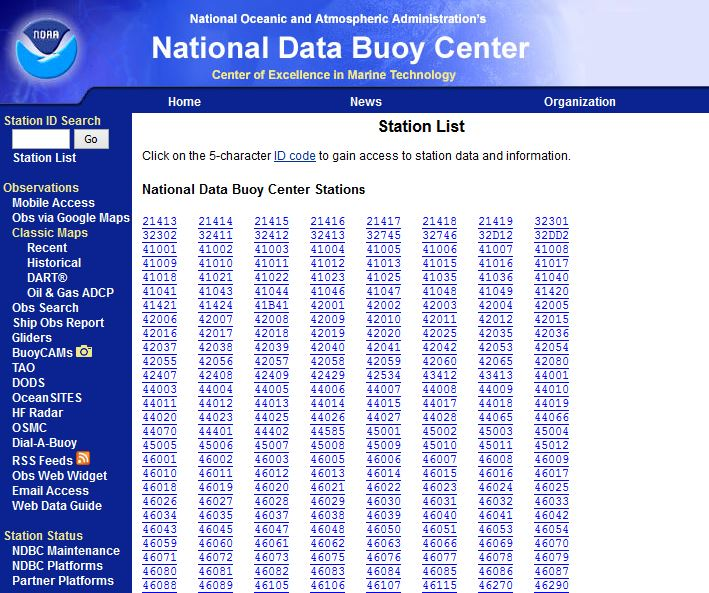
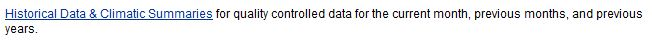
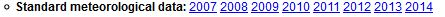
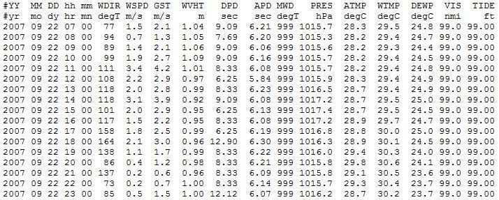

##Data Collection

For our project, we want meteorological data for each recorded storm observation in the North Atlantic.  To gather this data, we must combine meteorological data with storm observations.  The storm data comes from the NOAA Best Track Archive for Climate Stewardship (IBTrACS), and each row of this data represents a location in space and time, with values for latitude, longitude, time, and date.  To get the meteorological data at this location in the ocean, we will match the location and date-time with NOAA buoy records, select the nearest buoys to that latitude and longitude, and then look at their meteorological records at that date and time.  Our very first step will be to determine which NOAA buoys are in the correct location and have the information we need, and then make a list of those buoys.

A list of all stations can be found at [http://www.ndbc.noaa.gov/to_station.shtml](http://www.ndbc.noaa.gov/to_station.shtml); this is what part of the page looks like:

Each link is a different buoy number, and clicking on it will take you to the page for that specific buoy.  The page also contains lots of non-buoys stations, such as oil rigs, which we will have to deal with later. Let's look at one of the buoys, say [41046](http://www.ndbc.noaa.gov/station_page.php?station=41046). If we scroll down to the bottom of the page, we get a link to historical data:

Clicking on this link takes us to a page ( [http://www.ndbc.noaa.gov/station_history.php?station=41046](http://www.ndbc.noaa.gov/station_history.php?station=41046) ) with historical data, including standard meteorological data:

So buoy 41046 has historical meteorological data for 2007 - 2014, which is great for us! But to get it, we would have to click on each link for each year, which takes us to a text file.  Here's what the 2007 data ( [http://www.ndbc.noaa.gov/view_text_file.php?filename=41046h2007.txt.gz&dir=data/historical/stdmet/](http://www.ndbc.noaa.gov/view_text_file.php?filename=41046h2007.txt.gz&dir=data/historical/stdmet/) ) looks like:

